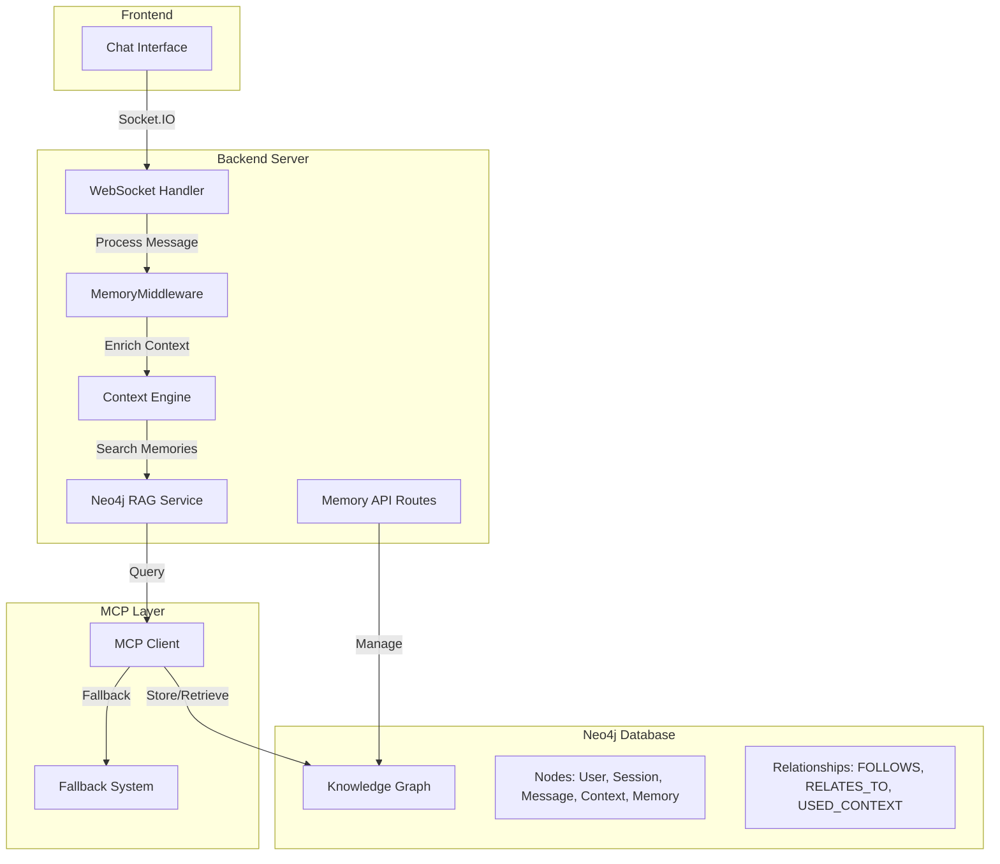

# 🧠 Integração Total com MCP Neo4j Memory - Documentação Completa

## 📝 Visão Geral

Este documento descreve a implementação completa do sistema de memória persistente integrado com Neo4j através do MCP (Model Context Protocol). TODAS as mensagens do chat agora passam pelo Neo4j, criando um grafo de conhecimento dinâmico e persistente.

## 🎨 Arquitetura do Sistema



## 🔄 Fluxo de Processamento de Mensagens

### 1️⃣ Recepção da Mensagem
```javascript
// server.js - Socket Handler
socket.on('send_message', async (data) => {
  const userId = socket.id;
  const sessionId = data.sessionId || uuidv4();
  const message = { content: data.message, role: 'user' };
  
  // Toda mensagem passa pelo MemoryMiddleware
  const processedMessage = await memoryMiddleware.processMessage(
    message,
    userId,
    sessionId
  );
});
```

### 2️⃣ Processamento no MemoryMiddleware

#### a) Busca de Contexto Relevante
```javascript
// MemoryMiddleware.js
async getRelevantContext(message, userId, sessionId) {
  const contexts = [];
  
  // 1. Histórico da sessão
  const sessionHistory = await this.ragService.searchMemories({
    query: `session:${sessionId}`,
    limit: 10,
    order_by: 'created_at DESC'
  });
  
  // 2. Memórias semânticas relacionadas
  const semanticMemories = await this.ragService.searchMemories({
    query: message.content,
    limit: 5
  });
  
  // 3. Padrões do usuário
  const userPatterns = await this.ragService.searchMemories({
    query: `user:${userId} type:pattern`,
    limit: 3
  });
  
  // 4. Conhecimento do domínio
  const domainKnowledge = await this.ragService.searchMemories({
    query: `domain:${message.domain}`,
    limit: 5
  });
  
  return contexts;
}
```

#### b) Enriquecimento da Mensagem
```javascript
enrichMessage(message, context) {
  const enriched = { ...message };
  
  // Adicionar contexto histórico
  enriched.previousMessages = sessionContext.data;
  
  // Adicionar memórias relacionadas
  enriched.relatedMemories = semanticContext.data;
  
  // Adicionar padrões identificados
  enriched.userPatterns = patterns.data;
  
  return enriched;
}
```

#### c) Processamento com Contexto
```javascript
async processWithContext(message, context) {
  const processed = { ...message };
  
  // Detectar intenção
  processed.intent = this.detectIntent(message, context);
  
  // Extrair entidades
  processed.entities = this.extractEntities(message.content);
  
  // Analisar sentimento
  processed.sentiment = this.analyzeSentiment(message.content);
  
  // Gerar tags
  processed.tags = this.generateTags(message, context);
  
  return processed;
}
```

### 3️⃣ Persistência no Neo4j

#### Schema do Grafo
```cypher
// Nós principais
(:User {id, name, created_at})
(:Session {id, userId, created_at, platform})
(:Message {id, content, role, intent, sentiment, timestamp})
(:Context {id, type, content, relevance})
(:Memory {id, content, type, created_at})
(:Pattern {userId, pattern, frequency, last_seen})

// Relacionamentos
(Message)-[:FOLLOWS {sequence}]->(Message)
(Message)-[:RELATES_TO {relevance}]->(Memory)
(Message)-[:USED_CONTEXT {relevance}]->(Context)
(Session)-[:HAS_MESSAGE]->(Message)
(User)-[:HAS_SESSION]->(Session)
(User)-[:HAS_PATTERN]->(Pattern)
```

#### Salvar Interação
```javascript
async saveInteraction(message, userId, sessionId, context) {
  // 1. Criar nó da mensagem
  const messageNode = await this.ragService.createMemory({
    label: 'message',
    properties: {
      id: generateId(),
      content: message.content,
      role: message.role,
      userId,
      sessionId,
      intent: message.intent,
      sentiment: message.sentiment,
      tags: message.tags.join(','),
      timestamp: new Date().toISOString()
    }
  });
  
  // 2. Conectar com mensagem anterior
  if (previousMessage) {
    await this.ragService.createConnection({
      fromMemoryId: messageNode.id,
      toMemoryId: previousMessage.id,
      type: 'FOLLOWS',
      properties: { sequence: messageCount }
    });
  }
  
  // 3. Conectar com memórias relacionadas
  for (const memory of relatedMemories) {
    await this.ragService.createConnection({
      fromMemoryId: messageNode.id,
      toMemoryId: memory.id,
      type: 'RELATES_TO',
      properties: { relevance: memory.relevance }
    });
  }
  
  // 4. Atualizar padrões do usuário
  await this.updateUserPatterns(userId, message.intent);
}
```

## 🌐 Endpoints de Gestão de Memória

### Endpoints Disponíveis

| Método | Endpoint | Descrição |
|--------|----------|------------|
| GET | `/api/memory/v2/search` | Buscar memórias |
| POST | `/api/memory/v2/context` | Obter contexto para mensagem |
| POST | `/api/memory/v2/process` | Processar mensagem com memória |
| GET | `/api/memory/v2/session/:id/summary` | Resumo da sessão |
| GET | `/api/memory/v2/session/:id/export` | Exportar sessão |
| POST | `/api/memory/v2/session/:id/import` | Importar sessão |
| POST | `/api/memory/v2/cleanup` | Limpar sessões antigas |
| GET | `/api/memory/v2/stats` | Estatísticas de memória |
| POST | `/api/memory/v2/create` | Criar memória manual |
| POST | `/api/memory/v2/connect` | Conectar memórias |
| PUT | `/api/memory/v2/:nodeId` | Atualizar memória |
| DELETE | `/api/memory/v2/:nodeId` | Deletar memória |

### Exemplos de Uso

#### Buscar Memórias
```bash
curl -X GET "http://localhost:8080/api/memory/v2/search?query=claude&limit=10"
```

#### Obter Contexto
```bash
curl -X POST "http://localhost:8080/api/memory/v2/context" \
  -H "Content-Type: application/json" \
  -d '{
    "message": {"content": "Como configurar o Neo4j?"},
    "userId": "user123",
    "sessionId": "session456"
  }'
```

#### Estatísticas
```bash
curl -X GET "http://localhost:8080/api/memory/v2/stats"
```

Resposta:
```json
{
  "success": true,
  "stats": {
    "neo4j": {
      "labels": [
        {"label": "message", "count": 1523},
        {"label": "pattern", "count": 47},
        {"label": "knowledge", "count": 89}
      ],
      "connected": true
    },
    "sessions": {
      "active": 12,
      "totalMessages": 256
    },
    "contextWindow": 10
  }
}
```

## 🤖 Detecção de Intenções

O sistema detecta automaticamente as seguintes intenções:

- **greeting**: Saudações (oi, olá, bom dia)
- **question**: Perguntas (como, quando, onde, por que)
- **command**: Comandos (faça, crie, execute, delete)
- **affirmation**: Afirmações (sim, ok, certo)
- **negation**: Negações (não, nunca, jamais)
- **thanks**: Agradecimentos (obrigado, valeu)
- **help**: Pedidos de ajuda (ajuda, socorro, explique)
- **code**: Relacionado a código (function, class, import)
- **config**: Configuração (configurar, setup, install)
- **error**: Erros (erro, bug, falha, problema)
- **continuation**: Continuação de conversa anterior
- **general**: Intenção geral

## 🔍 Extração de Entidades

O sistema extrai automaticamente:

- **URLs**: Links e endereços web
- **Emails**: Endereços de email
- **Files**: Menções a arquivos (.js, .py, .md, etc)
- **Numbers**: Números significativos (3+ dígitos)

## 📊 Análise de Sentimento

Três categorias:
- **positive**: Palavras positivas, emojis felizes
- **negative**: Palavras negativas, emojis tristes
- **neutral**: Sem polaridade clara

## 🏷️ Sistema de Tags

Tags são geradas automaticamente baseadas em:
- Intenção detectada
- Sentimento analisado
- Tipos de entidades encontradas
- Palavras-chave técnicas (api, database, frontend, etc)

## 🔄 Padrões de Usuário

O sistema rastreia e atualiza padrões de comportamento:

```javascript
// Estrutura de um padrão
{
  userId: "user123",
  type: "pattern",
  pattern: "question",  // Tipo de intenção mais comum
  frequency: 42,        // Número de ocorrências
  first_seen: "2024-01-01T10:00:00Z",
  last_seen: "2024-12-19T15:30:00Z"
}
```

## 🦼 Limpeza Automática

Sessões antigas são limpas automaticamente:
- Intervalo: A cada hora
- Critério: Sessões inativas há mais de 24 horas
- Memória local é limpa, mas Neo4j mantém histórico

## 🔒 Fallback e Resiliência

### Sistema de Fallback
Se o MCP falhar, o sistema usa conexão direta com Neo4j:

```javascript
// Neo4jRAGService com fallback
if (!this.mcp || !this.mcp.connected) {
  console.log('🔄 Using fallback Neo4j connection');
  return await this.fallbackQuery(query);
}
```

### Retry Logic
- 3 tentativas de conexão
- Timeout de 30 segundos
- Backoff exponencial entre tentativas

## 📦 Import/Export de Sessões

### Exportar Sessão
```javascript
GET /api/memory/v2/session/abc123/export

Response:
{
  "sessionId": "abc123",
  "messages": [...],
  "summary": {
    "messageCount": 42,
    "intents": ["question", "command"],
    "sentiments": {
      "positive": 20,
      "negative": 5,
      "neutral": 17
    },
    "lastMessage": "2024-12-19T15:30:00Z"
  },
  "exported_at": "2024-12-19T16:00:00Z"
}
```

### Importar Sessão
```javascript
POST /api/memory/v2/session/abc123/import
Content-Type: application/json

{
  "messages": [...],
  "summary": {...}
}
```

## 🎆 Benefícios da Implementação

1. **Memória Persistente**: Todas as conversas são permanentemente armazenadas
2. **Contexto Rico**: Cada mensagem é enriquecida com histórico relevante
3. **Aprendizado Contínuo**: Sistema aprende padrões do usuário
4. **Busca Semântica**: Encontra memórias relacionadas por conteúdo
5. **Grafo de Conhecimento**: Conexões entre conceitos e conversas
6. **Análise Avançada**: Intenções, sentimentos e entidades
7. **Resiliência**: Sistema de fallback garante funcionamento
8. **Escalabilidade**: Neo4j suporta milhões de nós e relações

## 🚀 Próximos Passos

1. **Machine Learning**: Treinar modelos com dados do grafo
2. **Embeddings**: Adicionar vetores para busca semântica avançada
3. **Visualização**: Interface para explorar o grafo de conhecimento
4. **Multi-tenant**: Suporte para múltiplos usuários/organizações
5. **Federação**: Compartilhar conhecimento entre instâncias

## 📖 Referências

- [Neo4j Documentation](https://neo4j.com/docs/)
- [MCP Protocol Spec](https://github.com/anthropics/mcp)
- [Claude Code SDK](https://github.com/anthropics/claude-code-sdk)
- [Socket.IO Documentation](https://socket.io/docs/)

---

**Versão**: 1.0.0
**Data**: 19/12/2024
**Status**: ✅ Implementação Completa