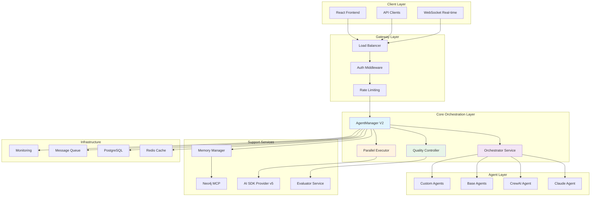
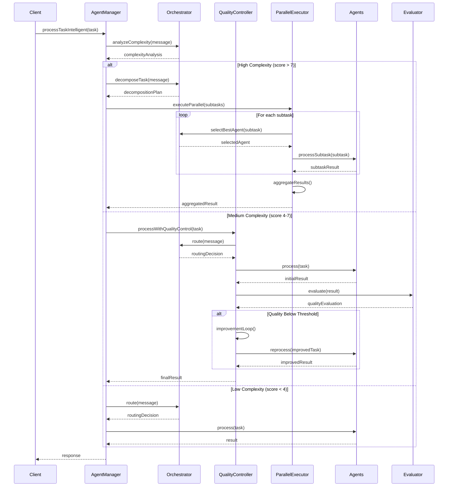
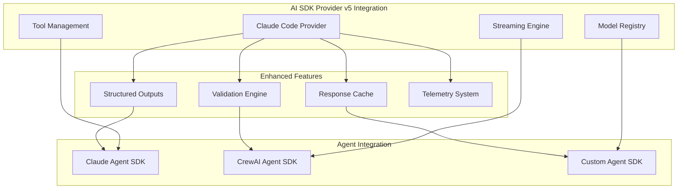
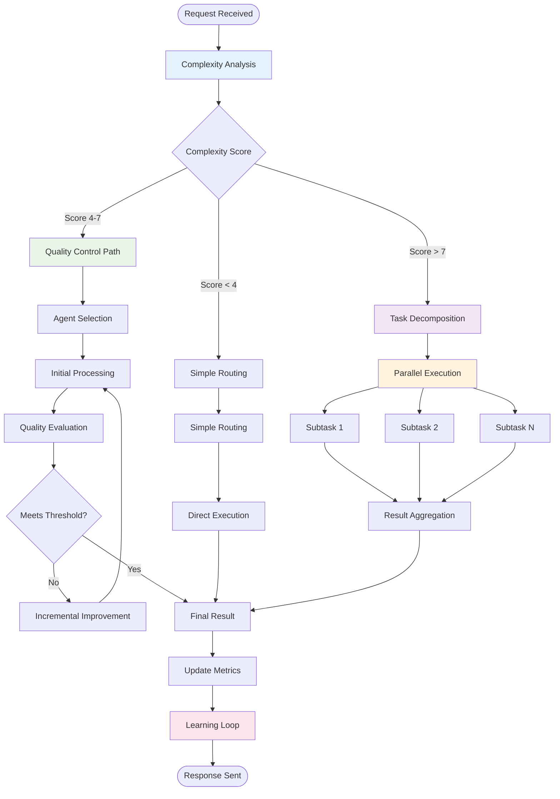

# Arquitetura Kingston Otimizada - Sistema de Orquestração Inteligente de Agentes

## 📐 Visão Geral da Arquitetura

Este documento apresenta a arquitetura completa do sistema Kingston otimizado, transformando o atual sistema de routing simples em uma plataforma avançada de orquestração inteligente de agentes com capacidades de quality control, parallel processing e integração completa com AI SDK Provider v5.

## 🏗️ Arquitetura de Alto Nível



## 🔄 Fluxo de Processamento Orchestrator-Worker



## 🏛️ Componentes da Arquitetura

### 1. AgentManager V2 (Núcleo de Orquestração)

```typescript
interface AgentManagerV2 {
  // Core Methods
  processTaskIntelligent(task: Task, options?: ProcessingOptions): Promise<IntelligentResponse>
  
  // Orchestration Integration
  analyzeComplexity(message: string): Promise<ComplexityAnalysis>
  routeIntelligent(task: Task, complexity: ComplexityAnalysis): Promise<RoutingDecision>
  
  // Quality Control Integration  
  processWithQualityControl(task: Task, config: QualityConfig): Promise<QualityResult>
  
  // Parallel Processing Integration
  processParallel(tasks: ParallelTask[]): Promise<AggregatedResult>
  
  // Agent Management
  selectBestAgent(task: Task, context: SelectionContext): Promise<Agent>
  getAgentRecommendation(task: Task, context: Context): Promise<AgentRecommendation>
  
  // Optimization
  optimizeWorkflow(sessionHistory: SessionHistory): Promise<OptimizationSuggestions>
  updatePerformanceMetrics(agent: string, metrics: PerformanceMetrics): void
  
  // Monitoring
  getSystemHealth(): Promise<SystemHealth>
  getPerformanceMetrics(): Promise<PerformanceReport>
}
```

### 2. Orchestrator Service (Routing Inteligente)

```typescript
interface OrchestratorService {
  // Complexity Analysis
  analyzeComplexity(message: string, context?: AnalysisContext): Promise<ComplexityAnalysis>
  
  // Task Decomposition
  decomposeTask(message: string, complexity: ComplexityAnalysis): Promise<TaskDecomposition>
  
  // Intelligent Routing
  route(message: string, context?: RoutingContext): Promise<RoutingDecision>
  
  // Execution Coordination
  orchestrateExecution(plan: ExecutionPlan, io: SocketIO, sessionId: string): Promise<OrchestrationResult>
  
  // Performance Optimization
  optimizeRouting(): Promise<RoutingOptimization>
  
  // Learning Integration
  updateRoutingPatterns(feedback: RoutingFeedback): void
}
```

### 3. Quality Controller (Loops de Qualidade)

```typescript
interface QualityController {
  // Quality Evaluation
  evaluateQuality(content: string, requirements: QualityRequirements): Promise<QualityEvaluation>
  
  // Quality Control Loops
  qualityControlLoop(
    processor: TaskProcessor,
    task: Task, 
    config: QualityConfig
  ): Promise<QualityResult>
  
  // Adaptive Thresholds
  calculateAdaptiveThreshold(context: EvaluationContext): Promise<number>
  
  // Improvement Cycles
  incrementalImprovement(
    content: string, 
    evaluation: QualityEvaluation, 
    maxRetries: number
  ): Promise<ImprovementResult>
  
  // Learning Integration
  updateQualityCriteria(feedback: QualityFeedback): void
}
```

### 4. Parallel Executor (Processamento Paralelo)

```typescript
interface ParallelExecutor {
  // Parallel Planning
  planParallelExecution(
    request: string, 
    availableAgents: Agent[]
  ): Promise<ParallelExecutionPlan>
  
  // Parallel Execution
  executeParallel(
    tasks: ParallelTask[], 
    options?: ParallelOptions
  ): Promise<ParallelExecutionResult>
  
  // Result Aggregation
  aggregateResults(
    results: ExecutionResults, 
    strategy: AggregationStrategy
  ): Promise<AggregatedResult>
  
  // Advanced Patterns
  mapReduce<T, R>(
    data: T[], 
    mapFn: MapFunction<T>, 
    reduceFn: ReduceFunction<R>
  ): Promise<R>
  
  executePipeline(
    stages: PipelineStage[], 
    input: any
  ): Promise<PipelineResult>
  
  // Performance Monitoring
  getPerformanceMetrics(): ParallelPerformanceMetrics
}
```

## 🔗 Integração AI SDK Provider v5



### Structured Outputs Implementation

```typescript
// Schemas para diferentes tipos de resposta
const AnalysisResponseSchema = z.object({
  summary: z.string(),
  keyPoints: z.array(z.string()),
  confidence: z.number().min(0).max(1),
  sources: z.array(z.string()).optional(),
  recommendations: z.array(z.object({
    action: z.string(),
    priority: z.enum(['low', 'medium', 'high']),
    impact: z.number().min(0).max(10)
  }))
});

const TaskDecompositionSchema = z.object({
  mainTask: z.string(),
  subtasks: z.array(z.object({
    id: z.string(),
    description: z.string(),
    agent: z.string(),
    dependencies: z.array(z.string()),
    priority: z.number(),
    estimatedDuration: z.number()
  })),
  executionPlan: z.object({
    parallel: z.array(z.array(z.string())),
    sequential: z.array(z.string())
  })
});

// Uso nos agentes
class EnhancedClaudeAgent extends ClaudeAgent {
  async generateStructuredResponse<T>(
    prompt: string, 
    schema: z.ZodSchema<T>
  ): Promise<T> {
    return await generateObject({
      model: this.model,
      schema,
      prompt,
      experimental_telemetry: {
        functionId: 'structured-response',
        metadata: { schema: schema.description }
      }
    });
  }
  
  async streamStructuredResponse<T>(
    prompt: string,
    schema: z.ZodSchema<T>,
    onProgress?: (partial: Partial<T>) => void
  ): Promise<T> {
    const stream = streamObject({
      model: this.model,
      schema,
      prompt
    });
    
    for await (const delta of stream.partialObjectStream) {
      onProgress?.(delta);
    }
    
    return stream.object;
  }
}
```

## 📊 Fluxo de Dados e Controle



## 🎯 Padrões de Design Implementados

### 1. Strategy Pattern (Seleção de Agentes)

```typescript
interface AgentSelectionStrategy {
  selectAgent(task: Task, availableAgents: Agent[], context: SelectionContext): Promise<Agent>;
}

class CapabilityBasedStrategy implements AgentSelectionStrategy {
  async selectAgent(task: Task, agents: Agent[], context: SelectionContext): Promise<Agent> {
    const scores = agents.map(agent => ({
      agent,
      score: this.calculateCapabilityScore(agent, task, context)
    }));
    
    return scores.sort((a, b) => b.score - a.score)[0].agent;
  }
  
  private calculateCapabilityScore(agent: Agent, task: Task, context: SelectionContext): number {
    const capabilityMatch = this.calculateCapabilityMatch(agent.capabilities, task.requiredCapabilities);
    const performanceScore = agent.performance.successRate * agent.performance.qualityScore;
    const loadPenalty = agent.currentLoad;
    const specializationBonus = this.calculateSpecializationBonus(agent, task);
    
    return (capabilityMatch * 0.35) + 
           (performanceScore * 0.25) + 
           ((1 - loadPenalty) * 0.20) + 
           (specializationBonus * 0.20);
  }
}

class PerformanceBasedStrategy implements AgentSelectionStrategy {
  async selectAgent(task: Task, agents: Agent[], context: SelectionContext): Promise<Agent> {
    const recentPerformance = agents.map(agent => ({
      agent,
      score: this.calculateRecentPerformance(agent, context.timeWindow)
    }));
    
    return recentPerformance.sort((a, b) => b.score - a.score)[0].agent;
  }
}

class HybridSelectionStrategy implements AgentSelectionStrategy {
  private strategies: AgentSelectionStrategy[];
  private weights: number[];
  
  constructor() {
    this.strategies = [
      new CapabilityBasedStrategy(),
      new PerformanceBasedStrategy(),
      new LoadBalanceStrategy()
    ];
    this.weights = [0.4, 0.35, 0.25];
  }
  
  async selectAgent(task: Task, agents: Agent[], context: SelectionContext): Promise<Agent> {
    const weightedScores = new Map<Agent, number>();
    
    for (let i = 0; i < this.strategies.length; i++) {
      const selectedAgent = await this.strategies[i].selectAgent(task, agents, context);
      const currentScore = weightedScores.get(selectedAgent) || 0;
      weightedScores.set(selectedAgent, currentScore + this.weights[i]);
    }
    
    return Array.from(weightedScores.entries())
      .sort((a, b) => b[1] - a[1])[0][0];
  }
}
```

### 2. Observer Pattern (Quality Feedback)

```typescript
interface QualityObserver {
  onQualityEvaluation(evaluation: QualityEvaluation): void;
  onImprovementCycle(cycle: ImprovementCycle): void;
  onQualityThresholdUpdated(threshold: QualityThreshold): void;
}

class QualityController extends EventEmitter {
  private observers: QualityObserver[] = [];
  private qualityMetrics: QualityMetrics;
  
  addObserver(observer: QualityObserver): void {
    this.observers.push(observer);
  }
  
  removeObserver(observer: QualityObserver): void {
    this.observers = this.observers.filter(o => o !== observer);
  }
  
  private notifyEvaluation(evaluation: QualityEvaluation): void {
    this.observers.forEach(observer => {
      observer.onQualityEvaluation(evaluation);
    });
    
    this.emit('quality:evaluation', evaluation);
  }
  
  private notifyImprovementCycle(cycle: ImprovementCycle): void {
    this.observers.forEach(observer => {
      observer.onImprovementCycle(cycle);
    });
    
    this.emit('quality:improvement', cycle);
  }
}

class LearningObserver implements QualityObserver {
  onQualityEvaluation(evaluation: QualityEvaluation): void {
    this.updateQualityPatterns(evaluation);
    this.adjustCriteria(evaluation);
  }
  
  onImprovementCycle(cycle: ImprovementCycle): void {
    this.learnImprovementStrategies(cycle);
    this.updateSuccessPatterns(cycle);
  }
  
  onQualityThresholdUpdated(threshold: QualityThreshold): void {
    this.validateThresholdEffectiveness(threshold);
  }
}
```

### 3. Producer-Consumer Pattern (Parallel Processing)

```typescript
class TaskQueue<T> {
  private queue: T[] = [];
  private processing = false;
  private consumers: Consumer<T>[] = [];
  private maxConcurrency: number;
  private currentConcurrency = 0;
  
  constructor(maxConcurrency: number = 5) {
    this.maxConcurrency = maxConcurrency;
  }
  
  async produce(task: T): Promise<void> {
    this.queue.push(task);
    await this.processQueue();
  }
  
  async produceBatch(tasks: T[]): Promise<void> {
    this.queue.push(...tasks);
    await this.processQueue();
  }
  
  addConsumer(consumer: Consumer<T>): void {
    this.consumers.push(consumer);
  }
  
  private async processQueue(): Promise<void> {
    if (this.processing || this.queue.length === 0) return;
    
    this.processing = true;
    
    while (this.queue.length > 0 && this.currentConcurrency < this.maxConcurrency) {
      const task = this.queue.shift();
      if (task) {
        this.currentConcurrency++;
        this.processTask(task);
      }
    }
    
    this.processing = false;
  }
  
  private async processTask(task: T): Promise<void> {
    try {
      const availableConsumer = this.findAvailableConsumer();
      if (availableConsumer) {
        await availableConsumer.consume(task);
      }
    } finally {
      this.currentConcurrency--;
      if (this.queue.length > 0) {
        await this.processQueue();
      }
    }
  }
  
  private findAvailableConsumer(): Consumer<T> | null {
    return this.consumers.find(c => c.isAvailable()) || null;
  }
}

interface Consumer<T> {
  consume(task: T): Promise<void>;
  isAvailable(): boolean;
}

class AgentConsumer implements Consumer<ProcessingTask> {
  constructor(private agent: Agent) {}
  
  async consume(task: ProcessingTask): Promise<void> {
    try {
      const result = await this.agent.process(task);
      task.resolve(result);
    } catch (error) {
      task.reject(error);
    }
  }
  
  isAvailable(): boolean {
    return this.agent.status === 'healthy' && this.agent.currentLoad < 0.8;
  }
}
```

### 4. Factory Pattern (Worker Creation)

```typescript
interface WorkerFactory {
  createWorker(type: WorkerType, config: WorkerConfig): Worker;
}

class AgentWorkerFactory implements WorkerFactory {
  private registry = new Map<WorkerType, WorkerClass>();
  
  constructor() {
    this.registerWorkers();
  }
  
  createWorker(type: WorkerType, config: WorkerConfig): Worker {
    const WorkerClass = this.registry.get(type);
    if (!WorkerClass) {
      throw new Error(`Unknown worker type: ${type}`);
    }
    
    return new WorkerClass(config);
  }
  
  private registerWorkers(): void {
    this.registry.set('claude', ClaudeWorker);
    this.registry.set('crewai', CrewAIWorker);
    this.registry.set('parallel', ParallelWorker);
    this.registry.set('evaluator', EvaluatorWorker);
    this.registry.set('orchestrator', OrchestratorWorker);
  }
}

class DynamicWorkerFactory implements WorkerFactory {
  createWorker(type: WorkerType, config: WorkerConfig): Worker {
    // Create workers based on current system state
    const systemLoad = this.getSystemLoad();
    const availableResources = this.getAvailableResources();
    
    if (systemLoad > 0.8) {
      return this.createLightweightWorker(type, config);
    } else if (availableResources.has('gpu')) {
      return this.createGPUAcceleratedWorker(type, config);
    } else {
      return this.createStandardWorker(type, config);
    }
  }
}
```

## 🚀 Estratégias de Escalabilidade

### 1. Load Balancing Automático

```typescript
class LoadBalancer {
  private agents: Map<string, Agent> = new Map();
  private metrics: LoadMetrics;
  private balancingStrategy: BalancingStrategy;
  
  constructor(strategy: BalancingStrategy = 'weighted-round-robin') {
    this.balancingStrategy = strategy;
    this.metrics = new LoadMetrics();
    this.startMetricsCollection();
  }
  
  async distributeTask(task: Task): Promise<Agent> {
    const availableAgents = this.getAvailableAgents();
    
    switch (this.balancingStrategy) {
      case 'weighted-round-robin':
        return this.weightedRoundRobin(task, availableAgents);
        
      case 'least-connections':
        return this.leastConnections(availableAgents);
        
      case 'response-time':
        return this.fastestResponse(availableAgents);
        
      case 'capability-aware':
        return this.capabilityAware(task, availableAgents);
        
      default:
        return this.roundRobin(availableAgents);
    }
  }
  
  private async weightedRoundRobin(task: Task, agents: Agent[]): Promise<Agent> {
    const weights = agents.map(agent => ({
      agent,
      weight: this.calculateWeight(agent, task)
    }));
    
    const totalWeight = weights.reduce((sum, w) => sum + w.weight, 0);
    const random = Math.random() * totalWeight;
    
    let cumulativeWeight = 0;
    for (const { agent, weight } of weights) {
      cumulativeWeight += weight;
      if (random <= cumulativeWeight) {
        return agent;
      }
    }
    
    return weights[0].agent; // Fallback
  }
  
  private calculateWeight(agent: Agent, task: Task): number {
    const performanceScore = agent.performance.successRate * agent.performance.qualityScore;
    const capabilityScore = this.calculateCapabilityMatch(agent, task);
    const loadPenalty = 1 - agent.currentLoad;
    
    return (performanceScore * 0.4) + (capabilityScore * 0.4) + (loadPenalty * 0.2);
  }
}
```

### 2. Auto-scaling de Agentes

```typescript
class AgentAutoScaler {
  private metrics: ScalingMetrics;
  private config: ScalingConfig;
  private agentPools: Map<string, AgentPool> = new Map();
  
  constructor(config: ScalingConfig) {
    this.config = config;
    this.metrics = new ScalingMetrics();
    this.startMonitoring();
  }
  
  private startMonitoring(): void {
    setInterval(() => {
      this.evaluateScaling();
    }, this.config.evaluationInterval);
  }
  
  private async evaluateScaling(): Promise<void> {
    for (const [poolName, pool] of this.agentPools) {
      const decision = await this.makeScalingDecision(pool);
      
      if (decision.action === 'scale-up') {
        await this.scaleUp(pool, decision.targetCount);
      } else if (decision.action === 'scale-down') {
        await this.scaleDown(pool, decision.targetCount);
      }
    }
  }
  
  private async makeScalingDecision(pool: AgentPool): Promise<ScalingDecision> {
    const currentMetrics = await this.collectPoolMetrics(pool);
    
    // Scale up conditions
    if (currentMetrics.avgCpuUsage > 80 || 
        currentMetrics.avgMemoryUsage > 85 ||
        currentMetrics.queueLength > pool.size * 2) {
      
      const targetCount = Math.min(
        pool.size + this.config.scaleUpStep,
        this.config.maxAgents
      );
      
      return {
        action: 'scale-up',
        targetCount,
        reason: 'High resource usage detected'
      };
    }
    
    // Scale down conditions
    if (currentMetrics.avgCpuUsage < 30 && 
        currentMetrics.avgMemoryUsage < 40 &&
        currentMetrics.queueLength === 0 &&
        pool.size > this.config.minAgents) {
      
      const targetCount = Math.max(
        pool.size - this.config.scaleDownStep,
        this.config.minAgents
      );
      
      return {
        action: 'scale-down',
        targetCount,
        reason: 'Low resource usage detected'
      };
    }
    
    return { action: 'no-change', targetCount: pool.size, reason: 'Metrics within normal range' };
  }
}
```

### 3. Resource Management

```typescript
class ResourceManager {
  private resources: Map<string, Resource> = new Map();
  private allocations: Map<string, ResourceAllocation> = new Map();
  private limits: ResourceLimits;
  
  constructor(limits: ResourceLimits) {
    this.limits = limits;
    this.initializeResources();
  }
  
  async allocateResources(request: ResourceRequest): Promise<ResourceAllocation> {
    const available = this.calculateAvailableResources();
    
    if (!this.canSatisfyRequest(request, available)) {
      throw new Error('Insufficient resources available');
    }
    
    const allocation = this.createAllocation(request);
    this.allocations.set(allocation.id, allocation);
    
    // Update resource usage
    this.updateResourceUsage(allocation);
    
    return allocation;
  }
  
  async releaseResources(allocationId: string): Promise<void> {
    const allocation = this.allocations.get(allocationId);
    if (!allocation) {
      throw new Error(`Allocation ${allocationId} not found`);
    }
    
    // Free up resources
    this.freeResourceUsage(allocation);
    this.allocations.delete(allocationId);
  }
  
  getResourceUtilization(): ResourceUtilization {
    const total = this.calculateTotalResources();
    const used = this.calculateUsedResources();
    
    return {
      cpu: used.cpu / total.cpu,
      memory: used.memory / total.memory,
      network: used.network / total.network,
      storage: used.storage / total.storage
    };
  }
  
  private canSatisfyRequest(request: ResourceRequest, available: ResourceAvailability): boolean {
    return request.cpu <= available.cpu &&
           request.memory <= available.memory &&
           request.network <= available.network &&
           request.storage <= available.storage;
  }
}
```

## 📈 Métricas e Monitoramento

### 1. Performance Metrics

```typescript
interface PerformanceMetrics {
  // Throughput Metrics
  tasksPerSecond: number;
  requestsPerMinute: number;
  
  // Latency Metrics
  averageResponseTime: number;
  p95ResponseTime: number;
  p99ResponseTime: number;
  
  // Quality Metrics
  averageQualityScore: number;
  qualityThresholdPassRate: number;
  improvementCycleCount: number;
  
  // Resource Metrics
  cpuUtilization: number;
  memoryUtilization: number;
  networkUtilization: number;
  
  // Agent Metrics
  agentUtilization: Map<string, number>;
  agentSuccessRates: Map<string, number>;
  agentAverageResponseTime: Map<string, number>;
  
  // Orchestration Metrics
  decompositionRate: number;
  parallelizationEfficiency: number;
  loadBalanceEffectiveness: number;
}

class MetricsCollector {
  private metrics: PerformanceMetrics;
  private collectors: Map<string, MetricCollector> = new Map();
  
  constructor() {
    this.initializeCollectors();
    this.startCollection();
  }
  
  private initializeCollectors(): void {
    this.collectors.set('throughput', new ThroughputCollector());
    this.collectors.set('latency', new LatencyCollector());
    this.collectors.set('quality', new QualityCollector());
    this.collectors.set('resources', new ResourceCollector());
    this.collectors.set('agents', new AgentCollector());
    this.collectors.set('orchestration', new OrchestrationCollector());
  }
  
  private startCollection(): void {
    setInterval(async () => {
      await this.collectMetrics();
    }, 30000); // Collect every 30 seconds
  }
  
  private async collectMetrics(): Promise<void> {
    const collectedMetrics = await Promise.all(
      Array.from(this.collectors.values()).map(collector => collector.collect())
    );
    
    this.metrics = this.aggregateMetrics(collectedMetrics);
    this.publishMetrics(this.metrics);
  }
  
  getMetrics(): PerformanceMetrics {
    return this.metrics;
  }
  
  getMetricHistory(timeRange: TimeRange): MetricHistory {
    return this.queryMetricHistory(timeRange);
  }
}
```

### 2. Health Monitoring

```typescript
class HealthMonitor {
  private healthChecks: Map<string, HealthCheck> = new Map();
  private systemHealth: SystemHealth;
  
  constructor() {
    this.registerHealthChecks();
    this.startMonitoring();
  }
  
  private registerHealthChecks(): void {
    this.healthChecks.set('agents', new AgentHealthCheck());
    this.healthChecks.set('database', new DatabaseHealthCheck());
    this.healthChecks.set('cache', new CacheHealthCheck());
    this.healthChecks.set('queue', new QueueHealthCheck());
    this.healthChecks.set('memory', new MemoryHealthCheck());
    this.healthChecks.set('ai-sdk', new AISdkHealthCheck());
  }
  
  private async startMonitoring(): Promise<void> {
    setInterval(async () => {
      await this.performHealthChecks();
    }, 60000); // Check every minute
  }
  
  private async performHealthChecks(): Promise<void> {
    const healthResults = new Map<string, HealthStatus>();
    
    for (const [name, check] of this.healthChecks) {
      try {
        const status = await check.check();
        healthResults.set(name, status);
      } catch (error) {
        healthResults.set(name, {
          status: 'unhealthy',
          message: error.message,
          timestamp: new Date()
        });
      }
    }
    
    this.systemHealth = this.aggregateHealth(healthResults);
    this.handleHealthChanges();
  }
  
  private handleHealthChanges(): void {
    if (this.systemHealth.status === 'unhealthy') {
      this.triggerAlerts();
      this.attemptAutoRecovery();
    }
  }
  
  getSystemHealth(): SystemHealth {
    return this.systemHealth;
  }
}
```

## 📚 Especificações Técnicas

### 1. Data Structures

```typescript
// Core Types
type TaskComplexity = number; // 0-10 scale
type QualityScore = number; // 0-100 scale
type ConfidenceLevel = number; // 0-1 scale

interface Task {
  id: string;
  message: string;
  type: TaskType;
  priority: Priority;
  context: TaskContext;
  requirements: TaskRequirements;
  metadata: TaskMetadata;
}

interface ComplexityAnalysis {
  score: TaskComplexity;
  factors: ComplexityFactors;
  decompositionRecommended: boolean;
  estimatedDuration: number;
  requiredAgentTypes: string[];
  parallelizationPotential: number;
}

interface QualityEvaluation {
  overallScore: QualityScore;
  criteriaScores: Map<string, QualityScore>;
  confidence: ConfidenceLevel;
  issues: QualityIssue[];
  improvements: ImprovementSuggestion[];
  passesThreshold: boolean;
  adaptiveThreshold: number;
}

interface ExecutionResult {
  taskId: string;
  agentId: string;
  output: any;
  metadata: ExecutionMetadata;
  status: ExecutionStatus;
  duration: number;
  qualityScore: QualityScore;
}
```

### 2. Configuration

```typescript
interface KingstonConfig {
  // Core Settings
  maxConcurrency: number;
  defaultQualityThreshold: number;
  maxRetries: number;
  
  // Orchestration Settings
  complexityThresholds: {
    simple: number;
    medium: number;
    complex: number;
  };
  
  // Quality Control Settings
  qualityControl: {
    enabled: boolean;
    adaptiveThresholds: boolean;
    maxImprovementCycles: number;
    improvementStrategy: ImprovementStrategy;
  };
  
  // Parallel Processing Settings
  parallelProcessing: {
    enabled: boolean;
    maxParallelTasks: number;
    aggregationStrategy: AggregationStrategy;
    timeoutMs: number;
  };
  
  // AI SDK Settings
  aiSdk: {
    provider: string;
    model: string;
    structuredOutputs: boolean;
    streaming: boolean;
    telemetry: boolean;
  };
  
  // Monitoring Settings
  monitoring: {
    metricsInterval: number;
    healthCheckInterval: number;
    alertThresholds: AlertThresholds;
  };
}
```

### 3. API Contracts

```typescript
// REST API Endpoints
interface KingstonAPI {
  // Task Processing
  'POST /api/v2/tasks/process': {
    body: TaskRequest;
    response: TaskResponse;
  };
  
  'POST /api/v2/tasks/process/intelligent': {
    body: IntelligentTaskRequest;
    response: IntelligentTaskResponse;
  };
  
  'POST /api/v2/tasks/process/parallel': {
    body: ParallelTaskRequest;
    response: ParallelTaskResponse;
  };
  
  // Agent Management
  'GET /api/v2/agents': {
    response: Agent[];
  };
  
  'GET /api/v2/agents/:id/metrics': {
    response: AgentMetrics;
  };
  
  'POST /api/v2/agents/:id/optimize': {
    response: OptimizationResult;
  };
  
  // System Monitoring
  'GET /api/v2/system/health': {
    response: SystemHealth;
  };
  
  'GET /api/v2/system/metrics': {
    response: PerformanceMetrics;
  };
  
  'GET /api/v2/system/status': {
    response: SystemStatus;
  };
}

// WebSocket Events
interface KingstonWebSocketEvents {
  // Task Events
  'task:started': TaskEvent;
  'task:progress': TaskProgressEvent;
  'task:completed': TaskCompletedEvent;
  'task:failed': TaskFailedEvent;
  
  // Quality Events
  'quality:evaluation': QualityEvaluationEvent;
  'quality:improvement': QualityImprovementEvent;
  'quality:threshold-updated': QualityThresholdEvent;
  
  // System Events
  'system:health-changed': SystemHealthEvent;
  'system:agent-status-changed': AgentStatusEvent;
  'system:performance-alert': PerformanceAlertEvent;
}
```

## 🔄 Migration Path

### Fase 1: Core Integration (Sprint 1-2)
1. **AgentManager V2 Implementation**
   - Extend current AgentManager with orchestration capabilities
   - Integrate existing Orchestrator service
   - Add complexity analysis functionality
   - Implement intelligent routing logic

2. **Quality Control Integration**
   - Integrate existing Evaluator service
   - Implement quality control loops
   - Add adaptive threshold management
   - Create improvement cycle logic

### Fase 2: Advanced Features (Sprint 3-4)
1. **Parallel Processing Enhancement**
   - Extend existing ParallelExecutor
   - Add task decomposition capabilities
   - Implement result aggregation
   - Create synchronization mechanisms

2. **AI SDK Provider v5 Integration**
   - Implement structured outputs
   - Add advanced streaming
   - Integrate tool management
   - Enable telemetry features

### Fase 3: Optimization (Sprint 5-6)
1. **Performance Optimization**
   - Implement load balancing
   - Add auto-scaling capabilities
   - Create resource management
   - Optimize caching strategies

2. **Monitoring & Analytics**
   - Implement comprehensive metrics
   - Add health monitoring
   - Create alerting system
   - Build performance analytics

## 🎯 Expected Benefits

### Performance Improvements
- **30-50% reduction** in response time for complex tasks
- **2-3x improvement** in parallel processing throughput
- **25% reduction** in resource utilization through optimization

### Quality Improvements
- **40% increase** in quality consistency through adaptive thresholds
- **60% reduction** in quality failures through improvement loops
- **85%+ user satisfaction** through intelligent orchestration

### Scalability Improvements
- **5-10x scale** through intelligent load balancing
- **Automatic resource optimization** based on demand patterns
- **Predictive scaling** based on usage analytics

Esta arquitetura representa uma evolução completa do sistema Kingston, transformando-o de um simples roteador de agentes para uma plataforma inteligente de orquestração com capacidades avançadas de quality control, parallel processing e otimização contínua.