# Diagramas Técnicos Detalhados - Kingston Otimizado

## 🏗️ Diagrama de Componentes Detalhado


## 🔄 Fluxo de Processamento Completo

```mermaid
sequenceDiagram
    participant Client
    participant Gateway
    participant AgentManager
    participant Orchestrator
    participant QualityController
    participant ParallelExecutor
    participant Agents
    participant Evaluator
    participant Cache
    participant Database

    Note over Client,Database: Início do Processamento Inteligente
    
    Client->>Gateway: POST /api/v2/tasks/process/intelligent
    Gateway->>Gateway: Autenticação & Rate Limiting
    Gateway->>AgentManager: processTaskIntelligent(task)
    
    Note over AgentManager: Análise de Complexidade
    AgentManager->>Cache: checkComplexityCache(taskHash)
    alt Cache Hit
        Cache-->>AgentManager: cachedComplexity
    else Cache Miss
        AgentManager->>Orchestrator: analyzeComplexity(message)
        Orchestrator-->>AgentManager: complexityAnalysis
        AgentManager->>Cache: storeComplexity(taskHash, analysis)
    end
    
    Note over AgentManager: Decisão de Workflow
    alt Alta Complexidade (score > 7)
        Note over AgentManager,ParallelExecutor: Decomposição e Processamento Paralelo
        
        AgentManager->>Orchestrator: decomposeTask(message, complexity)
        Orchestrator-->>AgentManager: taskDecomposition
        
        AgentManager->>ParallelExecutor: planParallelExecution(subtasks)
        ParallelExecutor-->>AgentManager: executionPlan
        
        AgentManager->>ParallelExecutor: executeParallel(plan)
        
        loop Para cada subtarefa
            ParallelExecutor->>Orchestrator: selectBestAgent(subtask)
            Orchestrator-->>ParallelExecutor: selectedAgent
            
            ParallelExecutor->>Agents: processSubtask(subtask)
            Agents-->>ParallelExecutor: subtaskResult
            
            ParallelExecutor->>Database: logExecutionMetrics(subtask, result)
        end
        
        ParallelExecutor->>ParallelExecutor: aggregateResults(results)
        ParallelExecutor-->>AgentManager: finalAggregatedResult
        
    else Média Complexidade (score 4-7)
        Note over AgentManager,QualityController: Processamento com Controle de Qualidade
        
        AgentManager->>QualityController: processWithQualityControl(task)
        
        QualityController->>Orchestrator: route(message, context)
        Orchestrator-->>QualityController: routingDecision
        
        QualityController->>Agents: process(task, agent)
        Agents-->>QualityController: initialResult
        
        QualityController->>Evaluator: evaluateQuality(result, requirements)
        Evaluator-->>QualityController: qualityEvaluation
        
        alt Qualidade Abaixo do Threshold
            Note over QualityController: Loop de Melhoria
            
            loop Até qualidade adequada ou max tentativas
                QualityController->>QualityController: generateImprovements(evaluation)
                QualityController->>Agents: reprocess(improvedTask)
                Agents-->>QualityController: improvedResult
                
                QualityController->>Evaluator: evaluateQuality(improvedResult)
                Evaluator-->>QualityController: newEvaluation
                
                QualityController->>Database: logQualityIteration(iteration, scores)
                
                break Qualidade Aceitável
                    Note over QualityController: Threshold atingido
                end
            end
        end
        
        QualityController-->>AgentManager: qualityAssuredResult
        
    else Baixa Complexidade (score < 4)
        Note over AgentManager,Orchestrator: Roteamento Simples Otimizado
        
        AgentManager->>Orchestrator: route(message, context)
        Orchestrator-->>AgentManager: routingDecision
        
        AgentManager->>Agents: process(task, selectedAgent)
        Agents-->>AgentManager: directResult
    end
    
    Note over AgentManager: Pós-processamento
    AgentManager->>Database: logTaskExecution(task, result, metrics)
    AgentManager->>Cache: cacheResult(taskSignature, result)
    
    Note over AgentManager: Aprendizado Contínuo
    AgentManager->>AgentManager: updatePerformanceMetrics(agent, execution)
    AgentManager->>AgentManager: updateRoutingPatterns(decision, outcome)
    
    AgentManager-->>Gateway: taskResponse
    Gateway-->>Client: HTTP 200 + response
    
    Note over Client,Database: WebSocket Notifications (Async)
    Gateway->>Client: WebSocket: task:completed
    Gateway->>Client: WebSocket: metrics:updated
```



## 🧩 Diagrama de Classes Principais


## 📊 Diagrama de Estados do Sistema


## 🔄 Diagrama de Integração AI SDK Provider v5

```mermaid
graph TB
    subgraph "AI SDK Provider v5"
        PROVIDER[Claude Code Provider<br/>- Model abstraction<br/>- Request management<br/>- Response parsing]
        
        REGISTRY[Model Registry<br/>- Model versions<br/>- Capability mapping<br/>- Load balancing]
        
        TOOLS[Tool Management<br/>- Dynamic tool loading<br/>- Validation<br/>- Execution context]
        
        STREAM[Streaming Engine<br/>- Real-time responses<br/>- Partial objects<br/>- Progress tracking]
        
        TELEMETRY[Telemetry System<br/>- Usage metrics<br/>- Performance data<br/>- Cost tracking]
    end
    
    subgraph "Enhanced Features"
        STRUCT[Structured Outputs<br/>- Zod schema validation<br/>- Type safety<br/>- Response formatting]
        
        VALID[Validation Engine<br/>- Input sanitization<br/>- Output verification<br/>- Error handling]
        
        CACHE[Intelligent Cache<br/>- Response caching<br/>- Semantic similarity<br/>- Cache invalidation]
        
        RETRY[Retry Logic<br/>- Exponential backoff<br/>- Circuit breaker<br/>- Fallback strategies]
    end
    
    subgraph "Agent Integration Layer"
        CLAUDE_SDK[Claude Agent SDK<br/>- generateObject()<br/>- generateText()<br/>- streamObject()]
        
        CREW_SDK[CrewAI Agent SDK<br/>- Multi-agent coordination<br/>- Task distribution<br/>- Result compilation]
        
        CUSTOM_SDK[Custom Agent SDK<br/>- Generic interfaces<br/>- Plugin architecture<br/>- External APIs]
    end
    
    subgraph "Application Layer"
        ORCHESTRATOR[Orchestrator Service]
        QUALITY[Quality Controller]
        PARALLEL[Parallel Executor]
    end
    
    %% Core Provider Connections
    PROVIDER --> STRUCT
    PROVIDER --> VALID
    PROVIDER --> CACHE
    PROVIDER --> RETRY
    
    REGISTRY --> PROVIDER
    TOOLS --> PROVIDER
    STREAM --> PROVIDER
    TELEMETRY --> PROVIDER
    
    %% Enhanced Features to SDK
    STRUCT --> CLAUDE_SDK
    STRUCT --> CREW_SDK
    STRUCT --> CUSTOM_SDK
    
    VALID --> CLAUDE_SDK
    CACHE --> CREW_SDK
    RETRY --> CUSTOM_SDK
    
    %% SDK to Application
    CLAUDE_SDK --> ORCHESTRATOR
    CLAUDE_SDK --> QUALITY
    CLAUDE_SDK --> PARALLEL
    
    CREW_SDK --> ORCHESTRATOR
    CREW_SDK --> PARALLEL
    
    CUSTOM_SDK --> ORCHESTRATOR
    
    %% Styling
    classDef provider fill:#e3f2fd,stroke:#0277bd,stroke-width:2px
    classDef enhanced fill:#f3e5f5,stroke:#7b1fa2,stroke-width:2px
    classDef sdk fill:#e8f5e8,stroke:#388e3c,stroke-width:2px
    classDef app fill:#fff3e0,stroke:#f57c00,stroke-width:2px
    
    class PROVIDER,REGISTRY,TOOLS,STREAM,TELEMETRY provider
    class STRUCT,VALID,CACHE,RETRY enhanced
    class CLAUDE_SDK,CREW_SDK,CUSTOM_SDK sdk
    class ORCHESTRATOR,QUALITY,PARALLEL app
```

## 📈 Diagrama de Métricas e Monitoramento


## 🔧 Diagrama de Deployment e Infraestrutura


Estes diagramas técnicos detalhados fornecem uma visão completa da arquitetura Kingston otimizada, mostrando:

1. **Componentes e suas responsabilidades específicas**
2. **Fluxos de processamento completos com decisões condicionais**
3. **Estrutura de classes e relacionamentos**
4. **Estados do sistema e transições**
5. **Integração com AI SDK Provider v5**
6. **Sistema de métricas e monitoramento**
7. **Arquitetura de deployment e infraestrutura**

Cada diagrama serve como uma especificação técnica detalhada para a implementação dos componentes do sistema otimizado.